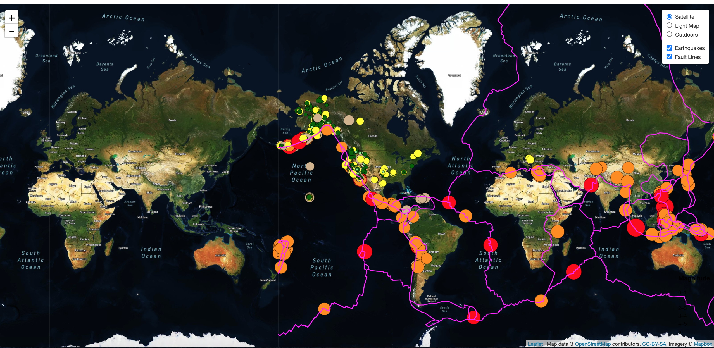

# Visualizing Earthquake Data with Leaflet

## Background

The United States Geological Survey, or USGS for short, is responsible for providing scientific data about natural hazards, the health of our ecosystems and environment; and the impacts of climate and land-use change. Their scientists develop new methods and tools to supply timely, relevant, and useful information about the Earth and its processes.

In this project the USGS is interested in building a new set of tools that will allow them visualize their earthquake data. They collect a massive amount of data from all over the world each day, but they lack a meaningful way of displaying it. Their hope is that being able to visualize their data will allow them to better educate the public and other government organizations (and hopefully secure more funding..) on issues facing our planet.

## The task at hand 

1. **Get data set**

   

   The USGS provides earthquake data in a number of different formats, updated every 5 minutes. The [USGS GeoJSON Feed](http://earthquake.usgs.gov/earthquakes/feed/v1.0/geojson.php) page was visited and the a data to visualize was picked. A URL was obtained of the JSON to pull in the data for our visualizations.

   

2. **Import & Visualize the Data**

   A map using Leaflet that plots all of the earthquakes from the data set based on their longitude and latitude was created.

   * Data markers reflect the magnitude of the earthquake in their size and color. Earthquakes with higher magnitudes appear larger and darker in color.

   * Popups that provide additional information about the earthquake when a marker is clicked were included.

   * A legend that will provide context for the map data was also created.

3. **More Data**

    The USGS also wants to plot a second data set on your map to illustrate the relationship between tectonic plates and seismic activity. So the second data set was pulled to visualize it along side the original set of data. Data on tectonic plates can be found at <https://github.com/fraxen/tectonicplates>.

